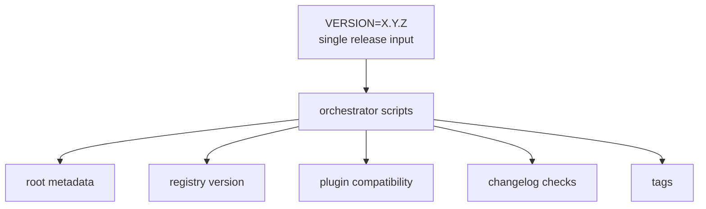
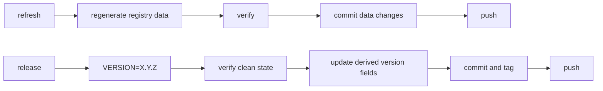
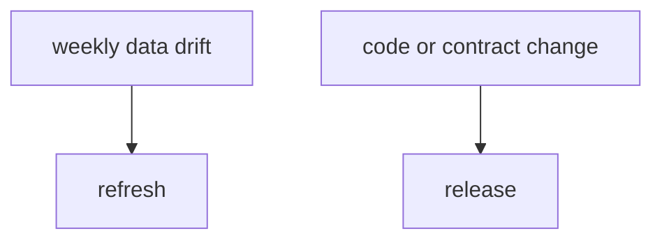

# Workflows

## Goal

Keep `refresh` and `release` as separate workflows, with one release input and the monorepo acting only as orchestrator.

## Target Model



The monorepo does not own release metadata.
It only propagates one explicit release input.

## Workflow Split



`refresh` is data-only.
`release` is version/tag-only.

## Refresh

Use refresh when:

- upstream repos changed
- stars changed
- detection improved
- bundled plugin fallback needs a new snapshot

Refresh should:

1. run pipeline
2. run verify
3. commit changed artifacts
4. update root submodule pointers
5. push

Refresh should not:

- bump versions
- edit changelogs
- create tags

## Release

Use release when:

- plugin behavior changes
- registry schema/output contract changes
- compatibility changes
- you intentionally want a tagged stable version

Release should:

1. choose `VERSION=X.Y.Z`
2. verify changelog entries
3. derive all version fields from that one input
4. commit downstream repos
5. update root submodule pointers
6. tag and push

## Suggested Release Input

```bash
make version VERSION=0.4.3
```

From that single input, derive:

- root version
- registry version
- plugin compatibility series
- release tags

## Why This Is Cleaner



This prevents:

- noisy release bumps for star-count changes
- manual version edits in multiple repos
- confusion about whether new data means a new release
